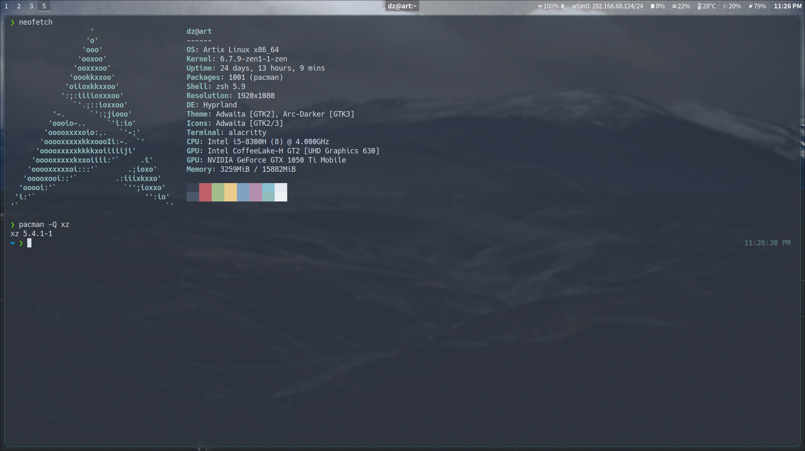

# Dotfiles

## How-to

### Automated (Ansible)

With Ansible installed, run `ansible-playbook run.yml -K` on your machine. Use `install.yml` or `dotfiles.yml` to install/copy config only. The install script assumes an Arch-based distro (it runs pacman), but the config script may have some use on other distros.

### Manual

Alternatively, check out the `~/.config/` version under the `master` branch.

## Obligatory neofetch

